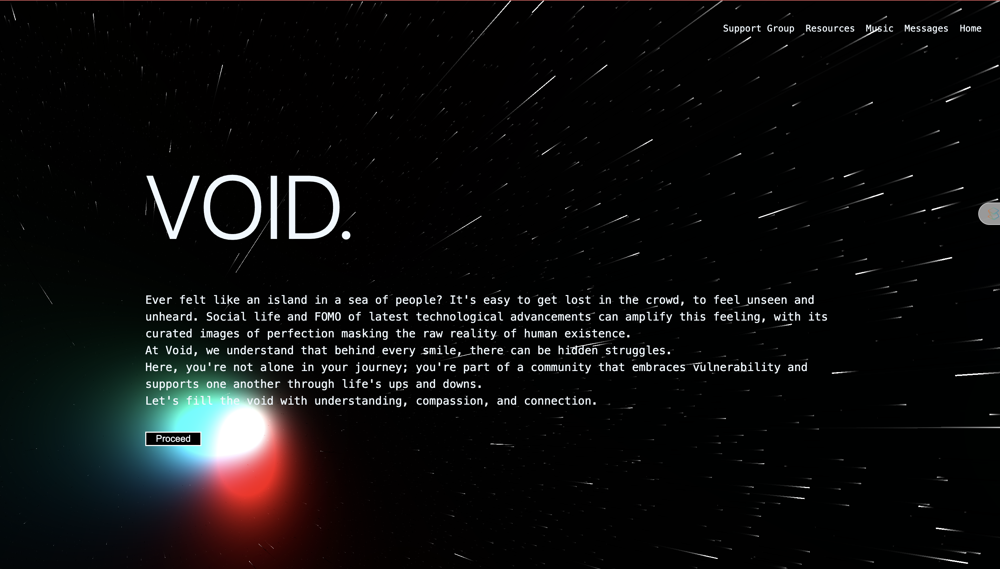
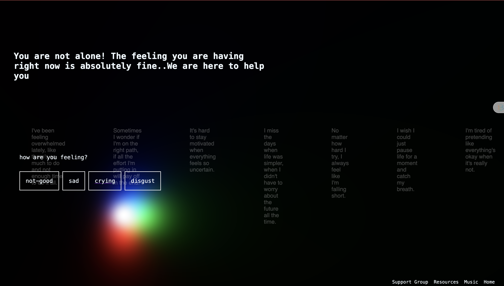
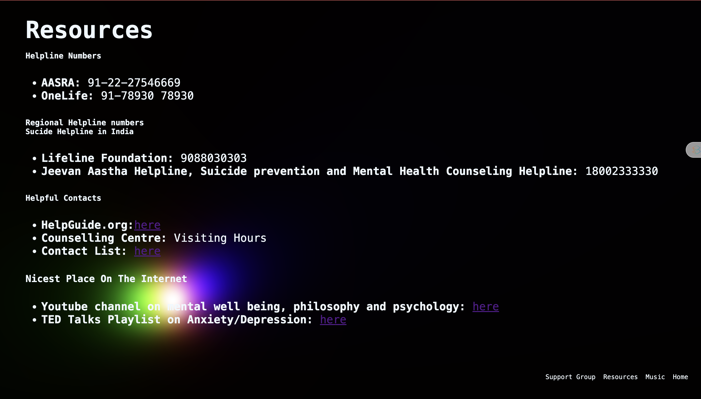

# Void
### Find solace in 'Void,' a gentle refuge amidst life's storms. Whether overwhelmed by anger, sadness, or emptiness, breathe freely here. You're not alone; let 'Void' guide you through, offering comfort and support.




src/Screenshot 2024-02-25 at 6.45.38 PM.png
## Setup
Download [Node.js](https://nodejs.org/en/download/).
Run this followed commands:

``` bash
# Install dependencies (only the first time)
npm install

# Run the local server at localhost:8080
npm run dev

# Build for production in the dist/ directory
npm run build
```

